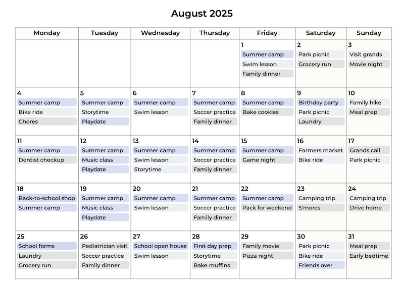

# Calio

Generates monthly calendars in HTML from one or more `.ics` files.

## Setup & Run
1) Edit `config.json` and set `WorkingFolder` to the folder containing your `.ics` files (output HTML is written there too).

```json
{ "WorkingFolder": "/absolute/path/to/ics" }
```

2) From the repo root:

```bash
dotnet build
dotnet run --project Calio.csproj
```

## Output
- Creates one file per month in `WorkingFolder`: `Calendar_YYYY_MM.html` for the current month and next 5.
 - Sample output:

	 

## Notes
- Fully written via an AI agent.
- Recurring events are expanded; multi‑day events appear on each day.
- Time zone uses your system local time; window is current month + 5 months.
- Events are color‑coded by source file (up to 4, then wrap).
- UI: Montserrat font, slightly bolder text, weekends shaded, event titles truncated with tooltip.

## License
MIT
